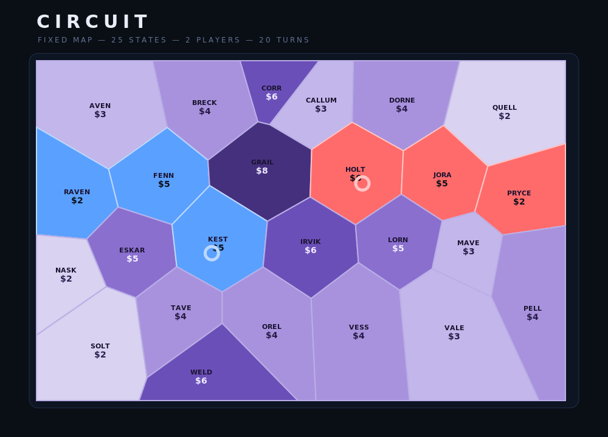

# CIRCUIT

**A strategic state-control board game for two players, in a single HTML file.**

CIRCUIT is a 2-player hot-seat strategy game played on a fixed map of 25 states. You start with a small budget and no income — every move and every claim spends it down. Over a set number of turns (default 20) you build the largest **connected cluster** of states, racing, blocking, and stealing your way across a board that's only a few moves wide.

No installation, no build step, no dependencies. It's one self-contained `index.html`.



## Play it

- **Online (GitHub Pages):** once this repo is published (see below), just open the Pages URL.
- **Locally:** download `index.html` and open it in any modern browser. That's it.

Two players share one screen (hot-seat) and pass the device each turn.

## How to play

- **Goal.** Build the biggest single **connected cluster** of states over the chosen number of turns (default 20). You can own several separate groups, but only your largest connected cluster counts. Ties break by total states owned, then by total coins spent buying states; if still tied, it's a draw.
- **Money.** You begin with 15 coins. The only income is **Hold** (+5), and coins are **capped at 20** to prevent hoarding. Spend carefully.
- **Each turn, pick one:**
  - **Roll a d3** and move your token 1–3 steps across borders, choosing the route one tile at a time. Claim the unclaimed Flop tile you land on (that ends your turn).
  - **Hold** to bank **+5 coins** and end your turn without moving.
- **Movement costs.** Crossing your own or empty land is free. Stepping onto an **opponent tile costs 1 coin each**. You can never make a move you can't fully pay for.
- **The Flop.** Only the **3** states in the Flop are claimable at any time; claiming one refills it.
- **Stealing.** Step onto an opponent's tile and pay **double its price** to seize it — great for splitting their cluster. A tile that just changed hands can't be stolen back next turn.
- **Secret Contracts.** You always hold one **private** target state, visible only to you. Walk your token onto it (it's unmarked — remember it by name), then **Buy** it from your panel; only that deliberate purchase reveals it. In **online** and **vs-AI** games your contract is always shown (the opponent can never see it anyway); in **hot-seat** you press **Reveal → Show → Buy** so a player sharing the screen can't peek. It never appears in the Flop and your opponent can't claim or steal it. Buying draws a new hidden one.

A full in-game **Rules** panel is available from the button in the top-right.

## Saving

Use **💾 Save** to download a `circuit-save.json` (your in-progress game plus results history), and **📂 Load** to read one back — there's also a *Load saved game* button on the start screen. Finished-game results still travel inside that JSON file; there's no separate in-app History panel. No browser storage is used: your data lives in a JSON file you control.

## Turn count

The start screen has a **Number of turns** input (default **20**) next to the player names. In **online** games the **host's** value is authoritative — the guest inherits it.

## AI opponent (Player 2)

On the start screen you can set **Player 2** to:

- **Human (hot-seat)** — two people share the screen (default).
- **Random bot** — picks any legal move with equal probability (a simple baseline engine).
- **Heuristic AI** — a built-in rule-based strategy (claims valuable connecting tiles, seizes bridges, manages coins). Offline, instant, free. In testing it beats the random bot ~99% of games.
- **OpenAI AI** — moves are chosen by an OpenAI model via function-calling (each legal move is a tool the model can call). This one needs the local server below.

AI turns are animated so you can watch them play. Player 1 is always human.

### Running the OpenAI bot (optional, local server)

The OpenAI key must **never** go in the game file or the repo, so a tiny local Node server holds it and makes the API calls. The browser talks to the server, not to OpenAI directly.

1. Install [Node.js](https://nodejs.org), then in this folder run `npm install`.
2. Copy `.env.example` to a file named exactly **`.env`** and paste your key: `OPENAI_API_KEY=sk-...`. **`.env` is git-ignored — never commit it.**
3. Run `node server.js`.
4. Open **http://localhost:8787** in your browser and choose **OpenAI AI** for Player 2.

The model is set in `server.js` (`MODEL = 'gpt-5.4-nano'`) — change that one line if your account uses a different model id. If the server is unreachable or errors, the OpenAI opponent automatically falls back to the heuristic AI so the game never stalls.

## Watch a finished game (replay)

Available in **`index.html`** (the single file runs local hot-seat, vs-AI, *and* online, so every mode is covered). When a game ends, click **⬇ Download this game** to save a `circuit-replay-*.json`. Later, from the start screen use **📂 Load game / watch replay**, pick that file, and step through it turn-by-turn with **◀ Prev / ▶ Play / Next ▶** (and **Exit replay**). The board is read-only during a replay. (In online games the host records and shares the replay with the guest, so both can download it.)

## Online multiplayer (two humans, via the server)

Online play is built into **`index.html`** — set **Player 2** to **🌐 Online opponent**. Players connect through the Node server, which relays moves by a **4-character room code**: one player **Creates** a game (gets a code), the other **Joins** with it. Human vs human; the AI opponents stay a local feature.

### Try it locally
1. `npm install`, then `node server.js`.
2. Open **http://localhost:8787** in two browser windows and set **Player 2 → 🌐 Online opponent**.
3. In one, click **Create online game** and copy the 4-char code; in the other, type the code and **Join**. Play.

### Deploy free on Render.com
1. Push this repo to GitHub (below).
2. On **render.com**: **New → Web Service**, connect your repo.
3. Set **Runtime = Node**, **Build = `npm install`**, **Start = `npm start`**, **Instance = Free**, and create. (Or use **New → Blueprint** — the included `render.yaml` configures it automatically.)
4. When live, share **https://<your-app>.onrender.com/** — one player Creates, the other Joins with the code.

Notes: Render’s free tier sleeps after ~15 min idle (first visit then takes ~30–60s to wake), and in-progress online games live in server memory, so a restart ends them (just start a new code).

## Publish on GitHub Pages

1. Create a new GitHub repository and push these files (see below).
2. In the repo, go to **Settings → Pages**.
3. Under **Build and deployment**, set **Source = Deploy from a branch**, **Branch = `main`**, **Folder = `/ (root)`**, and Save.
4. Wait a minute; your game will be live at `https://<your-username>.github.io/<repo-name>/`.

Because the entry file is named `index.html`, Pages serves the game automatically at that URL.

## Push this folder to GitHub

```bash
# from inside this folder
git init
git add .
git commit -m "CIRCUIT: initial release (hot-seat)"
git branch -M main
git remote add origin https://github.com/<your-username>/<repo-name>.git
git push -u origin main
```

(If `git init` and the first commit were already made for you, skip to `git remote add` and `git push`.)

## What's here

| File | Purpose |
|------|---------|
| `index.html` | The complete game — hot-seat, bots, OpenAI AI, and online play (this is what GitHub Pages serves). |
| `DESIGN.md` | Human-readable summary of the rules and design decisions. |
| `CIRCUIT_GDD.docx` | The full Game Design Document (v0.4) with the complete change history. |
| `CHANGELOG.md` | Version-by-version summary of how the design evolved. |
| `assets/` | Screenshot used in this README. |
| `server.js`, `package.json`, `render.yaml` | Node server: serves the game, relays online play, optional OpenAI opponent. |
| `.env.example` | Template for the OpenAI key (copy to `.env`). |

## Notes

- **Two ways to play multiplayer:** hot-seat (same screen) and online (two devices via the server) — both live in `index.html`. Online needs the Node server running (locally or on Render); GitHub Pages is static-only, so online play won't work when served from Pages (hot-seat and the local bots still do).
- Built as a sing